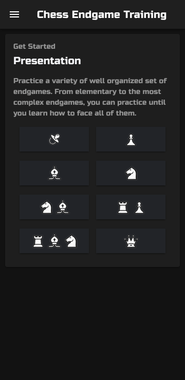
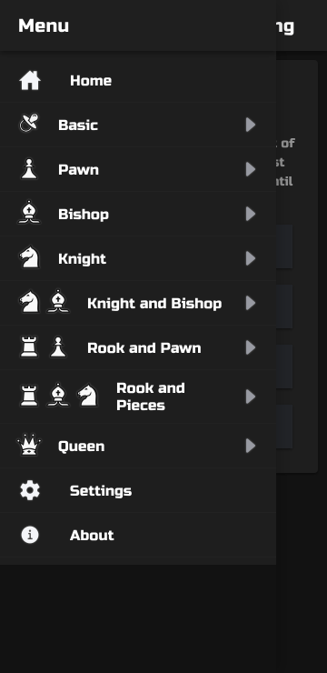
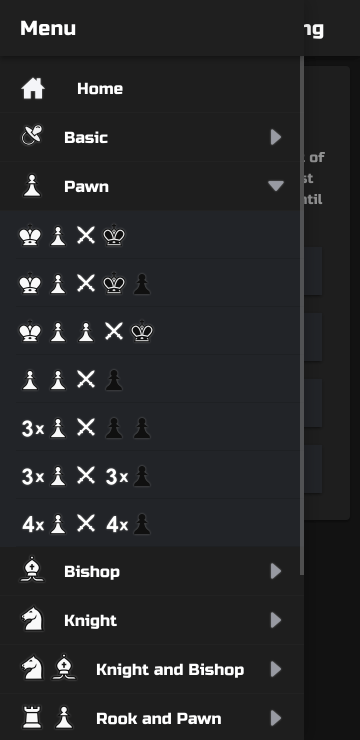
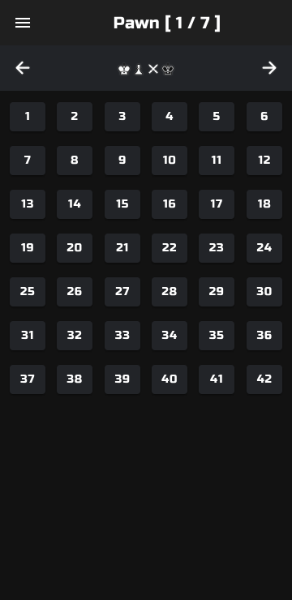
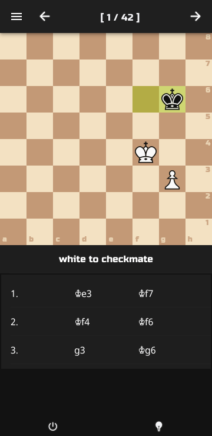
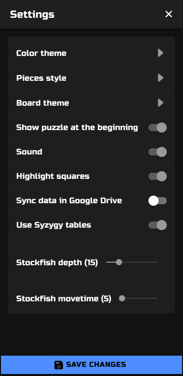
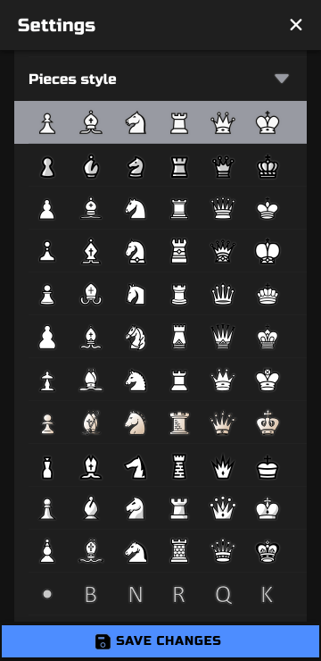

[Chess Endgame Training](https://github.com/supertorpe/chessendgametraining)

<a style="margin-bottom: 0;" href='https://play.google.com/store/apps/details?id=com.supertorpe.chessendgametraining'></a>

Chess Endgame Training is a web application to practice a variety of well organized chess endgames.

* It allows you to play against the Syzygy tablebases or against the Stockfish 16 NNUE engine.

* The application tracks your personal record in each position. It also allows you to solve each position automatically and review the movements once completed.

* It includes challenges of mate and also of draw, for both white and black.

* Save configurations and progress to Google Drive to avoid losing them.

* When reaching a trivial position, it doesn't force you to solve it manually (it prompts you to resolve those last moves automatically without penalizing you for it).

* Parameterize Stockfish by depth and time.

* List of moves: allows you to select a move and continue another line from there.

* Manual mode: to move opponent's pieces to explore lines not suggested by syzygy or Stockfish: "what if...?"

* Uses the chessground board which allows you to draw circles and arrows.

* Light and dark themes.

* Multiple piece styles.

* Several board colors to choose from.

* Multi language (currently English/Spanish).

* Board image capture.

* Copy FEN and PGN to clipboard.

* Button to open position analysis on Lichess.


It is distributed in both [Android App](https://play.google.com/store/apps/details?id=com.supertorpe.chessendgametraining) and [Progressive Web App](https://chess-endgame-trainer.mooo.com). The Web App allows to open an arbitrary position from a FEN string indicating the objective to achieve (checkmate or draw) : https://chess-endgame-trainer.mooo.com/fen/FEN_STRING/TARGET

TARGET is checkmate by default. Examples:

[https://chess-endgame-trainer.mooo.com/fen/8/4p1p1/8/7k/2qN3B/4P1P1/2B4K/8 w - - 0 1](https://chess-endgame-trainer.mooo.com/fen/8/4p1p1/8/7k/2qN3B/4P1P1/2B4K/8%20w%20-%20-%200%201)

[https://chess-endgame-trainer.mooo.com/fen/8/5qpB/5P2/4B2N/8/p7/P2k4/K7 w - - 0 1/draw](https://chess-endgame-trainer.mooo.com/fen/8/5qpB/5P2/4B2N/8/p7/P2k4/K7%20w%20-%20-%200%201/draw)

Optionally, you can change roles and play with the opponent pieces:

[http://chess-endgame-trainer.mooo.com/fen/8/3k4/8/3K4/3P4/8/8/8 b - - 0 1?player=w](http://chess-endgame-trainer.mooo.com/fen/8/3k4/8/3K4/3P4/8/8/8%20b%20-%20-%200%201?player=w)


You can also play random positions to achieve checkmate in 1 to 10 moves. 

[http://chess-endgame-trainer.mooo.com/checkmate/3](http://chess-endgame-trainer.mooo.com/checkmate/3)


## Screenshots
<div style="display:flex;" >







</div>

## 3dparty resources

Following software and resources has been used:

* [ECO Chess Opening Codes Endgame database](https://ecochessopeningcodes.blogspot.com/2016/01/play-chess-endgame-positions-with.html): Database of chess endgames

* [chess.js](https://github.com/jhlywa/chess.js): A Javascript chess library for chess move generation/validation, piece placement/movement, and check/checkmate/draw detection
* [chessground](https://github.com/lichess-org/chessground): A Javascript chess board
* [lila-stockfish-web](https://github.com/lichess-org/lila-stockfish-web): WASM implementation of Stockfish chess engine used in Lichess
* [Syzygy endgame tablebases](https://github.com/lichess-org/lila-tablebase): Online database with information for all endgame positions with up to 7 pieces
* [Typescript](https://www.typescriptlang.org/): JavaScript with syntax for types
* [Ionic Framework](https://ionicframework.com/): the mobile sdk for the web
* [Alpine.js](https://alpinejs.dev/): lightweight JavaScript framework
* [Alpine i18n](https://github.com/rehhouari/alpinejs-i18n): Internationalization (i18n) support for Alpine.js
* [Navigo](https://github.com/krasimir/navigo): a simple vanilla JavaScript router
* [howler.js](https://github.com/goldfire/howler.js): JavaScript audio library for the modern web
* [dom-to-image](https://github.com/InYourHead/dom-to-image): generates an image from a DOM node using HTML5 canvas
* [Vite](https://vitejs.dev/): fast build tool
* [Logo](https://www.iconfinder.com/icons/1688870/business_chess_strategy_icon): designed by Inipagi from Iconfinder
* [Pacifier](https://www.flaticon.com/free-icon/pacifier_134980): designed by Smashicons from Flaticon
* Chess piece sets: alpha (Eric Bentzen), [california (Jerry S)](https://sites.google.com/view/jerrychess/home), [cburnett (Colin M.L. Burnett)](https://commons.wikimedia.org/wiki/Category:SVG_chess_pieces#/media/File:Chess_Pieces_Sprite.svg), [chess7 (Alexander Sizenko)](http://www.styleseven.com/php/get_product.php?product=Chess-7%20font), [chessnut (Alexis Luengas)](https://github.com/LexLuengas/chessnut-pieces), [chicago (Benjamin Friedrich)](https://github.com/benjfriedrich/chess-foundry-pack), companion (David L. Brown), [fantasy (Maurizio Monge)](https://commons.wikimedia.org/wiki/Category:SVG_chess_pieces/Maurizio_Monge), [iowa (Benjamin Friedrich)](https://github.com/benjfriedrich/chess-foundry-pack), [kosal (philatype)](https://github.com/philatype/kosal), leipzig (Armando Hernández Marroquin), letter (???), merida (Armando Hernández Marroquin), mono (???), [oslo (Benjamin Friedrich)](https://github.com/benjfriedrich/chess-foundry-pack), [pirouetti](https://lichess.org/@/pirouetti), [pixel (therealqtpi)](https://twitter.com/therealqtpi), [reilly (Reilly Craig)](http://reillycraig.ca), riohacha (???), [shapes (Jimmie Elvenmark)](https://github.com/flugsio/chess_shapes), [spatial (Maurizio Monge)](https://commons.wikimedia.org/wiki/Category:SVG_chess_pieces/Maurizio_Monge), [symmetric (Arcticpenguins)](https://www.dropbox.com/sh/jws5b0hgf71udsf/AAAZCxF4PQ02nkhwPZN3qHxia?dl=0)
* [Russo One](https://fonts.google.com/specimen/Russo+One): text font by Jovanny Lemonad
* [Move sound](https://github.com/lichess-org/lila/blob/master/public/sound/standard/Move.mp3): from Lichess static resources
* [Capture sound](https://github.com/lichess-org/lila/blob/master/public/sound/standard/Capture.mp3): from Lichess static resources
* [Success sound](https://freesound.org/people/shinephoenixstormcrow/sounds/337049/): shinephoenixstormcrow from freesound.org
* [Fail sound](https://freesound.org/people/Bertrof/sounds/131657/): Bertrof from freesound.org

## Development

A Docker image is provided to bootstrap a development environment:

Build image
```
./exec.sh build-img
```
Start development server
```
./exec.sh start
```
Build for production
```
./exec.sh build-app
```
If you don't want to use Docker, you can install Node.js (latest LTS) and a package manager (i.e. pnpm) to install dependencies, start the development server and build for production.

### TWA / Android bundle

A TWA has been generated with [bubblewrap](https://github.com/GoogleChromeLabs/bubblewrap):
```
bubblewrap init --manifest https://chess-endgame-trainer.mooo.com/manifest.json
```
Building:
```
bubblewrap build --skipSigning
```
Signing:
```
jarsigner -verbose -sigalg SHA1withRSA -digestalg SHA1 -keystore [PATH_TO_KEYSTORE] ./app-release-unsigned-aligned.apk [KEY_ALIAS]
zipalign -v 4 ./app-release-unsigned-aligned.apk myapp-aligned.apk
apksigner sign --ks [PATH_TO_KEYSTORE] --v1-signing-enabled true --v2-signing-enabled true myapp-aligned.apk
```
The file .well-known/assetslinks.json includes the Sha256 fingerprint of the certificate used to sign the apk:
```
keytool -list -v -keystore [PATH_TO_KEYSTORE]
```
