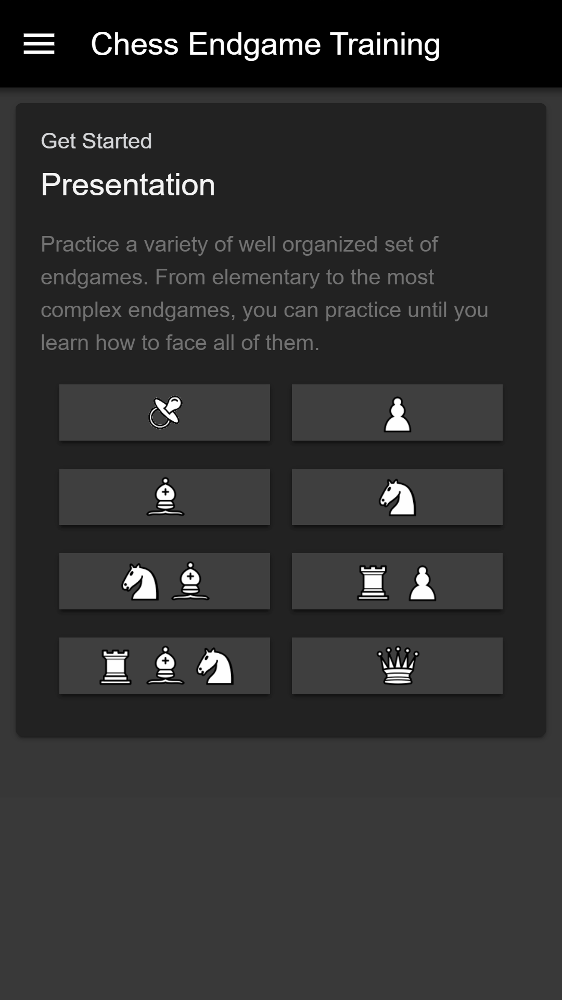
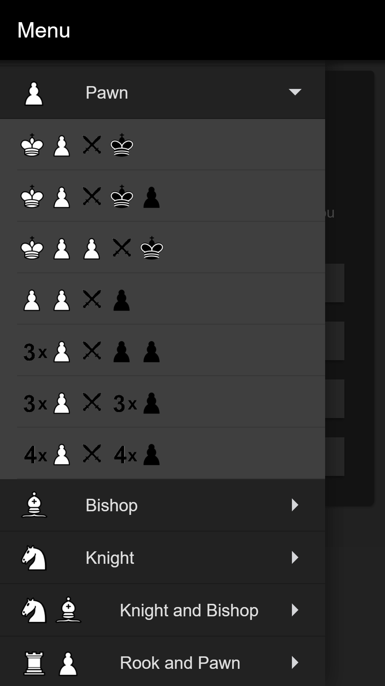
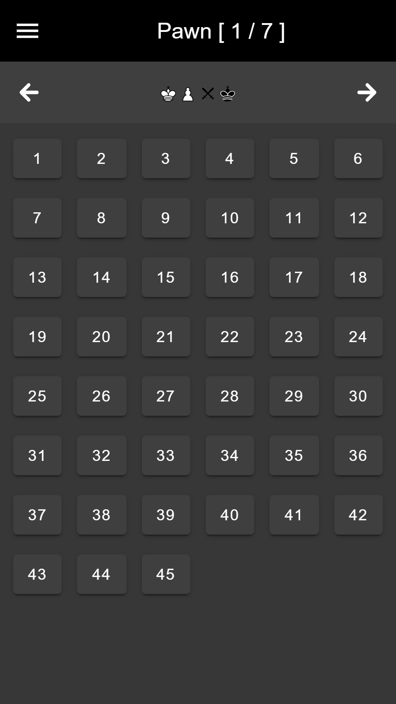
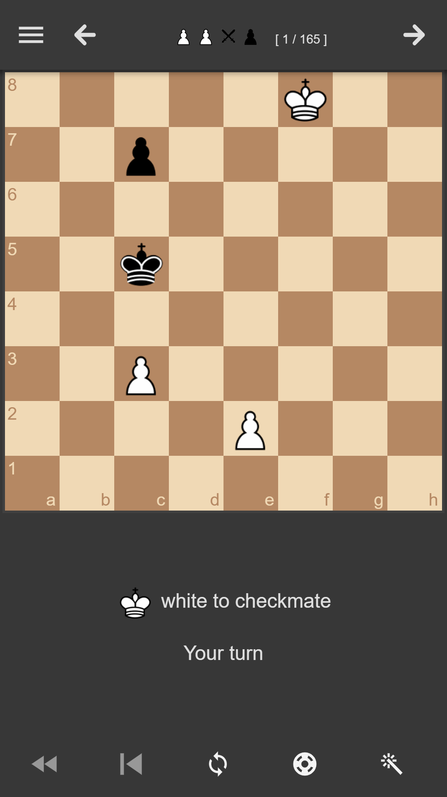
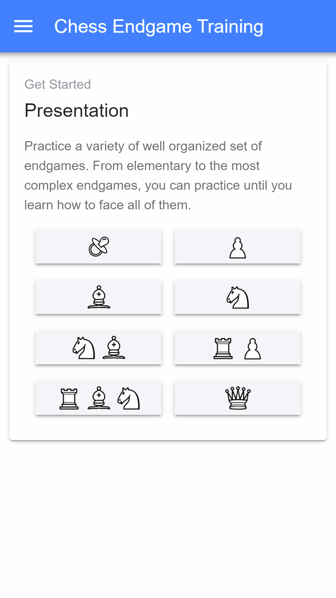
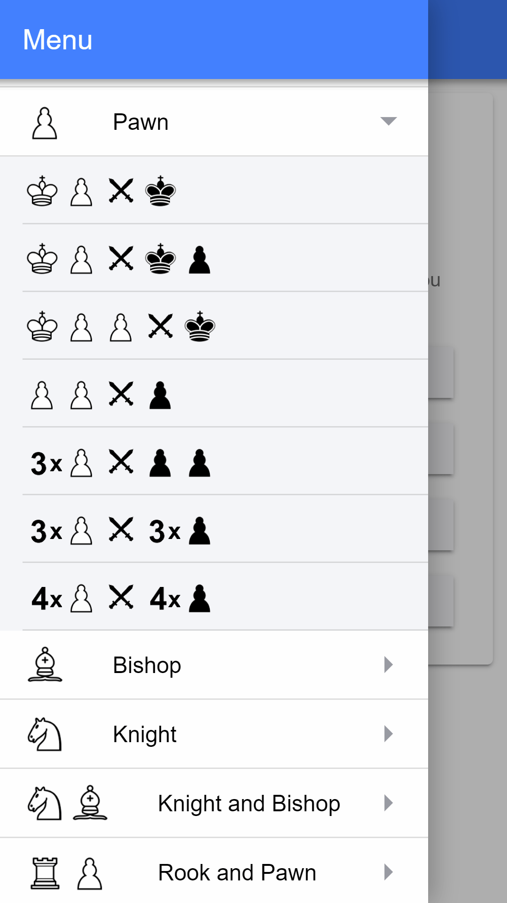
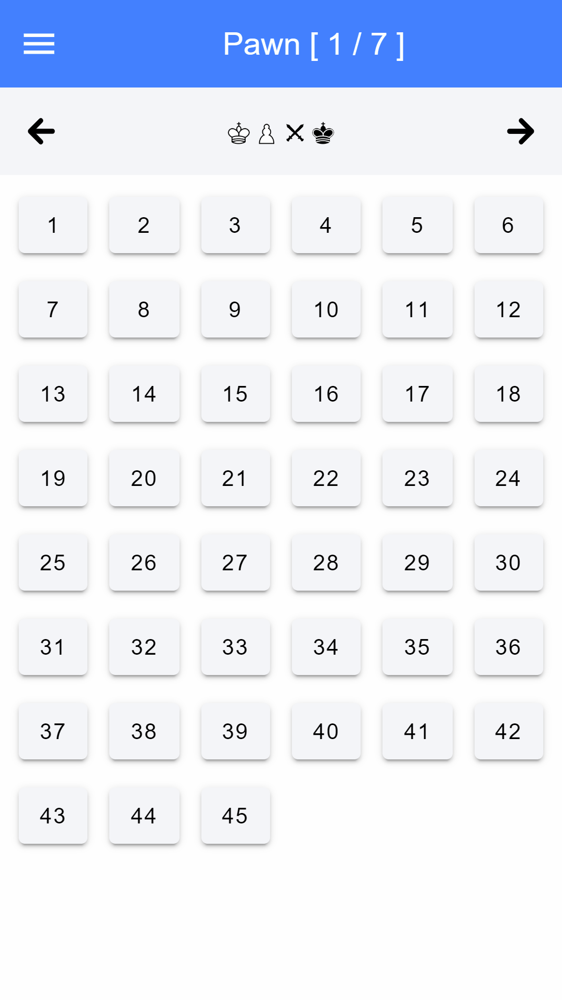
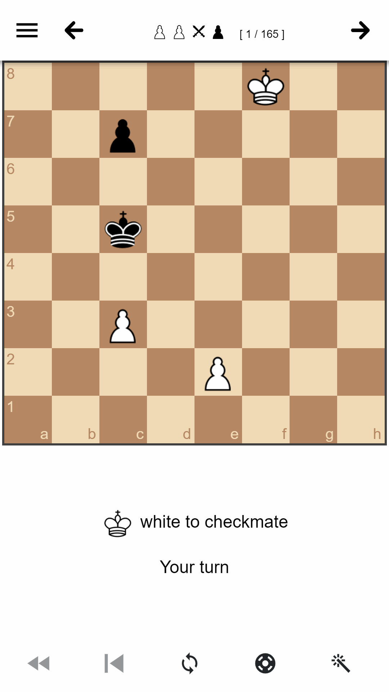

[Chess Endgame Training](https://github.com/supertorpe/chessendgametraining)

--------------------

Chess Endgame Training is a [ionic](https://ionicframework.com/) / [cordova](https://cordova.apache.org/) application. It is written
in [TypeScript](http://www.typescriptlang.org/) and [Angular](https://angular.io/).

## Screenshots

Following software and resources has been used:

* [chess.js](https://github.com/jhlywa/chess.js): A Javascript chess library for chess move generation/validation, piece placement/movement, and check/checkmate/draw detection
* [chessboard.js](http://chessboardjs.com): A Javascript chess board
* [stockfish.js](https://github.com/niklasf/stockfish.js): The strong open source chess engine Stockfish compiled to JavaScript and WebAssembly using Emscripten
* [Lichess Syzygy endgame tablebases API](https://github.com/niklasf/lila-tablebase): Online database with information for all endgame positions with up to 7 pieces
* [ECO Chess Opening Codes Endgame database](http://ecochessopeningcodes.blogspot.com.es/2016/01/play-chess-endgame-positions-with.html): Database of chess endgames
* Free Icons by Smashicons from Flaticon, Inipagi from Iconfinder and Cburnett from Wikimedia Commons 
